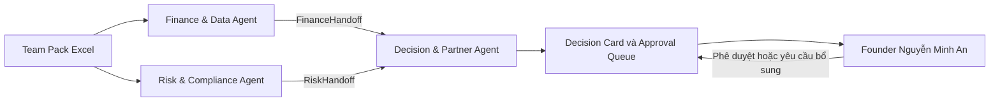

# OPC AI Decision Support System

Nguyên mẫu hệ thống AI Agent hỗ trợ ra quyết định cho MIS Talent 2026.

## 1. Tổng quan dự án

Hệ thống hỗ trợ founder **Nguyễn Minh An** ra quyết định đối với cơ hội kinh doanh **CON-004**: mở rộng mạng lưới hợp tác xã tại 20 tỉnh thành, giá trị **4,2 tỷ VND**. Doanh nghiệp OPC không có phòng ban chuyên trách, vì vậy hệ thống được thiết kế như một nhóm trợ lý AI có phạm vi trách nhiệm rõ ràng, giúp founder tổng hợp dữ liệu và kiểm soát rủi ro trước khi ra quyết định.

Nguyên mẫu đồng thời xử lý ba vấn đề:

- Thiếu hụt dòng tiền trong giai đoạn triển khai hợp đồng.
- Cụm giao dịch ngân hàng đáng ngờ cần tạm giữ và xác nhận.
- Nhu cầu tín dụng để tài trợ vốn lưu động và bảo lãnh thực hiện hợp đồng.

Kết quả cuối cùng là một **Decision Card** có cấu trúc, trình bày nhu cầu tài chính, rủi ro còn lại, bằng chứng còn thiếu, các điều kiện cần đáp ứng và chuỗi phê duyệt của founder.

## 2. Kiến trúc 3 AI Agent

Hệ thống gồm ba AI Agent chuyên trách và **không có Orchestrator Agent riêng biệt**:

| Agent | Trách nhiệm chính | Đầu ra bàn giao |
| --- | --- | --- |
| Finance & Data Agent | Phân tích dòng tiền, công nợ, biên lợi nhuận, tính khả thi và nhu cầu tín dụng | `FinanceOutput` và `FinanceHandoff` |
| Risk & Compliance Agent | Phát hiện giao dịch bất thường, đánh giá hồ sơ tín dụng, rủi ro quản trị, vận hành và xử lý dữ liệu nhạy cảm | `RiskOutput` và `RiskHandoff` |
| Decision & Partner Agent | Kết hợp hai handoff, đối chiếu sản phẩm ngân hàng và tạo Decision Card cho founder | Decision Card, approval queue và runtime log |

Finance & Data Agent và Risk & Compliance Agent xử lý độc lập trên cùng Team Pack. Decision & Partner Agent không đọc lại dữ liệu thô; agent chỉ tiêu thụ hai object đã được đóng băng theo schema Pydantic.



Bảy quy tắc nghiệp vụ từ **RR-001 đến RR-007** đóng vai trò logic điều phối. Mỗi agent tự xác định khi nào cần dừng, bàn giao dữ liệu hoặc yêu cầu con người can thiệp. Founder là người điều phối thực chất vì OPC là doanh nghiệp một người và mọi quyết định có hệ quả tài chính hoặc pháp lý đều quay về founder.

| Quy tắc | Vai trò trong nguyên mẫu |
| --- | --- |
| RR-001 | Tạm giữ giao dịch có điểm rủi ro cao và yêu cầu founder xác nhận |
| RR-002 | Phát hiện vi phạm mức dự trữ tiền mặt và đề xuất phương án vốn lưu động |
| RR-003 | Cảnh báo hợp đồng có biên lợi nhuận thấp hơn ngưỡng |
| RR-004 | Chặn việc gửi tài liệu ra đối tác cho tới khi có phê duyệt con người |
| RR-005 | Yêu cầu phê duyệt đối với quyết định tài chính có giá trị lớn |
| RR-006 | Yêu cầu bổ sung bằng chứng hoặc không đưa ra khuyến nghị khi độ tin cậy thấp |
| RR-007 | Cảnh báo chậm tiến độ và mức phạt vận hành tiềm tàng |

## 3. Nguyên tắc thiết kế cốt lõi

### Xử lý song song

Finance & Data Agent và Risk & Compliance Agent xử lý độc lập và có thể chạy đồng thời. Hai agent không phụ thuộc đầu ra của nhau, giúp tránh tạo một chuỗi xử lý tuần tự không cần thiết.

### Bàn giao qua object có cấu trúc

Ranh giới tích hợp được định nghĩa bằng các Pydantic model trong `src/contracts.py`. Decision & Partner Agent chỉ sử dụng `FinanceHandoff` và `RiskHandoff`, không tự đọc lại hoặc diễn giải lại Team Pack. Các field tài chính dùng hậu tố `_vnd`; metric suy diễn có trường `_basis` để công khai cơ sở tính toán.

### Con người giữ quyền quyết định cuối

AI Agent chỉ phân tích, chuẩn bị hồ sơ và đề xuất. Hệ thống không tự gửi hồ sơ, thực hiện giao dịch hoặc tạo cam kết tài chính/pháp lý. Các điểm phê duyệt AP-1 đến AP-5 buộc luồng xử lý quay lại founder trước hành động quan trọng.

### An toàn khi thất bại

Khi OpenAI API không khả dụng, phản hồi lỗi hoặc trả về payload sai schema, Decision & Partner Agent chuyển sang **deterministic fallback** và tiếp tục pipeline. Chế độ fallback được ghi rõ trong Decision Card và runtime log thay vì che giấu lỗi hoặc dừng toàn bộ chương trình.

### Bảo vệ dữ liệu nhạy cảm

Các trường bị hạn chế như `customer_id`, `account_id`, `counterparty_id`, `contract_value` và `access_token` được mask hoặc tokenize trước khi hiển thị/bàn giao. Runtime log ghi danh sách `masked_fields` nhưng không ghi API key hoặc credential thô.

## 4. Kết quả nổi bật của dữ liệu mẫu

Với Team Pack hiện tại, pipeline tạo ra các kết quả chính:

- Sáu tháng dự báo đều vi phạm mức dự trữ tiền mặt.
- Tháng thiếu hụt nghiêm trọng nhất theo `funding_need` là `2026-07`, với nhu cầu **1,19 tỷ VND**.
- Tổng ba hóa đơn đang mở là **635 triệu VND**.
- Gói tín dụng phục vụ quyết định gồm vốn lưu động và bảo lãnh thực hiện, tổng đề nghị **1,37 tỷ VND**.
- Cụm `TXN-006/TXN-007` có tổng exposure **178 triệu VND** và kích hoạt RR-001.
- `CR-003` bị giữ ở trạng thái không khuyến nghị do thiếu xác nhận nhà cung cấp.
- CON-004 có lợi nhuận gộp dự kiến **1,008 tỷ VND**, nhưng chỉ nên tiếp tục khi các điều kiện và phê duyệt liên quan đã hoàn tất.

Các con số trên được tạo từ workbook đi kèm và được khóa bằng regression test; đây không phải dữ liệu ngân hàng xác nhận ngoài hệ thống.

## 5. Yêu cầu môi trường

- Python 3.10 trở lên.
- `pip` và khả năng tạo virtual environment.
- Trình duyệt web hiện đại.
- Không bắt buộc OpenAI API key để chạy luồng demo mặc định.

Nguồn dữ liệu mặc định:

```text
data/MISTalent2026_OPC_AgenticAI_TeamPack_v2-1.xlsx
```

## 6. Cài đặt

Mở PowerShell tại thư mục dự án:

```powershell
cd "mis-talent-2026-semifinal"
python -m venv .venv
.\.venv\Scripts\python.exe -m pip install --upgrade pip
.\.venv\Scripts\python.exe -m pip install -r requirements.txt
```

Không cần kích hoạt virtual environment nếu sử dụng trực tiếp `.venv\Scripts\python.exe` như các lệnh trong tài liệu này.

## 7. Chạy Dashboard

Khởi động Streamlit:

```powershell
.\.venv\Scripts\python.exe -m streamlit run app.py --server.port 8501
```

Sau đó truy cập:

```text
http://localhost:8501
```

Bản local không yêu cầu đăng nhập. Tài khoản Giám khảo và Quản trị viên không áp dụng vì nguyên mẫu chưa triển khai phân quyền người dùng.

Nếu cổng `8501` đang được sử dụng, có thể chọn cổng khác:

```powershell
.\.venv\Scripts\python.exe -m streamlit run app.py --server.port 8502
```

Khi đó truy cập `http://localhost:8502`.

## 8. Chế độ OpenAI tùy chọn

Không có `OPENAI_API_KEY`, hệ thống vẫn chạy đầy đủ bằng deterministic fallback. Để thử chế độ live trong PowerShell:

```powershell
$env:OPENAI_API_KEY="your-api-key"
$env:OPENAI_MODEL="gpt-4o"
.\.venv\Scripts\python.exe -m streamlit run app.py --server.port 8501
```

Trong Dashboard, bật tùy chọn **Dùng OpenAI live**. OpenAI chỉ được dùng tại Decision & Partner Agent để tạo phần diễn giải `conflicts_detected`, `conditions` và `rationale`. Các số liệu tài chính, ID, rule và trạng thái phê duyệt vẫn đến từ pipeline có cấu trúc.

Không ghi API key vào source code, README, ảnh chụp màn hình hoặc runtime log.

## 9. Chạy kiểm thử

Chạy toàn bộ regression test:

```powershell
.\.venv\Scripts\python.exe -m pytest -q
```

Test đọc Team Pack thật và kiểm tra schema, phép tính, rule, masking, handoff, Decision Card và Bank API mock. Nếu đổi tên field, làm sai số liệu hoặc phá vỡ contract Pydantic, test tương ứng sẽ thất bại.

## 10. Xuất artifact trình diễn

Tạo lại backend output, Decision Card và runtime log:

```powershell
.\.venv\Scripts\python.exe scripts\export_demo_outputs.py
```

Các file đầu ra:

```text
output/demo_backend_output.json
output/demo_decision_card.json
runtime_logs/sample_runtime_log.json
```

Script xuất artifact cố ý dùng chế độ OpenAI fallback để kết quả có tính xác định và có thể tái lập trên máy chấm không có API key.

## 11. Luồng demo đề xuất

1. Mở trang **Tổng quan** và chỉ ra trạng thái `DỮ LIỆU: EXCEL LIVE`, mã hash nguồn dữ liệu và thời điểm phân tích.
2. Chọn **CON-004** tại trang **Chi tiết hợp đồng**.
3. Trình bày kết quả Finance Agent: sáu tháng breach, worst month `2026-07` và gói tín dụng 1,37 tỷ VND.
4. Trình bày kết quả Risk Agent: cụm `TXN-006/TXN-007`, exposure 178 triệu VND và trạng thái bị chặn bởi AP-1.
5. Duyệt AP-1 để mở khóa luồng Decision Agent.
6. Xem Bank Fit Matrix, Decision Card và trường hợp `CR-003` còn thiếu bằng chứng.
7. Đi qua AP-2, AP-3 và AP-4 trước khi thử Bank API mock/sandbox.
8. Chọn quyết định cuối: phê duyệt, từ chối, yêu cầu thêm thông tin hoặc đàm phán lại.
9. Mở trang **Bằng chứng hệ thống** để xem dữ liệu đã tokenize và runtime log.

## 12. Bank API và giới hạn nguyên mẫu

- Bank API chỉ là **mock/sandbox**; không có hồ sơ nào được gửi đến ngân hàng thật.
- HTTP status `200`, `400`, `401`, `409`, `429` và `503` có thể được mô phỏng để trình diễn safe-failure.
- Team Pack hiện cung cấp `collateral_ratio` nhưng không cung cấp đầy đủ `collateral_vnd` tuyệt đối. Các giá trị thế chấp tuyệt đối trong Decision Card được đánh dấu bằng `collateral_basis=prototype_fallback_not_provided_by_11_BANK_PRODUCTS`.
- Dashboard là công cụ hỗ trợ quyết định, không phải hệ thống giao dịch hoặc phê duyệt tài chính production.
- Trạng thái phiên và approval queue hiện được lưu trong `st.session_state`; khởi động lại ứng dụng sẽ tạo phiên mới.

## 13. Cấu trúc thư mục

```text
mis-talent-2026-semifinal/
|-- app.py                         # Streamlit Dashboard
|-- config/
|   `-- policies.yaml              # Ngưỡng và lựa chọn policy
|-- data/
|   `-- MISTalent2026_...xlsx      # Team Pack đầu vào
|-- docs/                           # Tài liệu scope, metric và quyết định thiết kế
|-- fixtures/                       # Finance/Risk output mẫu
|-- runtime_logs/
|   `-- sample_runtime_log.json     # Nhật ký vận hành mẫu
|-- scripts/
|   |-- export_demo_outputs.py      # Xuất artifact demo
|   `-- generate_fixtures.py        # Tạo lại fixture
|-- src/
|   |-- agents.py                   # Entrypoint Finance/Risk
|   |-- contracts.py                # Pydantic schema và handoff contract
|   |-- decision_agent.py           # Decision Card, OpenAI và Bank API mock
|   |-- resolvers.py                # Logic Finance
|   |-- risk.py                     # Logic Risk và masking handoff
|   |-- rules.py                    # Nạp và resolve business rules
|   |-- runtime_log.py              # Cấu trúc runtime log
|   |-- security.py                 # Masking và tokenization
|   |-- team_pack.py                # Đọc workbook/policy
|   `-- validation.py               # Data health và cross-validation
|-- submission/                     # Hướng dẫn nhanh và thông tin truy cập
|-- tests/                          # Regression test
|-- requirements.txt
`-- README.md
```

## 14. Tài liệu liên quan

- `submission/quickstart_1page.md`: hướng dẫn trình diễn một trang.
- `submission/prototype_credentials.txt`: thông tin truy cập nguyên mẫu local.
- `docs/DS1_SCOPE_MATRIX.md`: mapping dữ liệu, code và yêu cầu báo cáo.
- `docs/METRIC_GLOSSARY.md`: định nghĩa các metric chính.
- `docs/SPEC_GAPS.md`: các điểm chưa rõ trong đặc tả và cách xử lý.
- `runtime_logs/sample_runtime_log.json`: nhật ký mẫu có `trace_id`, lịch sử tool/API và `masked_fields`.

## 15. Tái tạo fixture sau khi thay đổi contract

Chỉ chạy khi thay đổi schema hoặc logic đã được nhóm thống nhất:

```powershell
.\.venv\Scripts\python.exe scripts\generate_fixtures.py
```

Các contract tích hợp tuân theo nguyên tắc **additive-only** trong giai đoạn freeze: ưu tiên thêm field mới; không đổi tên hoặc xóa field đang được consumer sử dụng. Các lựa chọn policy nằm trong `config/policies.yaml` và được công khai qua trường `*_basis`.

---

Nguyên mẫu được xây dựng để giúp founder ra quyết định có căn cứ, có dấu vết kiểm toán và có điểm dừng an toàn — không thay thế trách nhiệm phê duyệt của con người.
